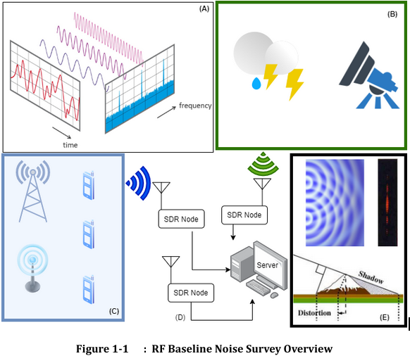

# Radio Frequency (RF) Noise Survey

## Overview

The RF Noise Survey is an open source tool developed by the WIRG lab at the University of Colorado Boulder to measure baseline radio frequency (RF) interference. This tool is designed to run on a Raspberry Pi 4 connected to an Ettus Research B200mini USRP (Software Defined Radio). It aids in understanding and improving RF spectrum sharing for both communications and scientific purposes.

> **Key Features:**
> - **Command Line Surveys:** Run surveys via CLI using Python scripts.
> - **Optional Integration with OpenZMS as a reconfigureable monitor.

## Quick Start Guide
Welcome to the RF Noise Survey, an open source tool for measuring baseline radio frequency interference. These surveys are designed to be run on a Raspberry Pi 4 connected to an Ettus Research B200mini Universal Software Radio Peripheral (USRP) Software Defined Radio (SDR).

Releases are available via GH releases.

See template.env for example configuration. OpenZms configuration is optional. 


## Introduction
Developed by the WIRG lab at the University of Colorado Boulder under NSF [SWIFT](https://new.nsf.gov/funding/opportunities/spectrum-wireless-innovation-enabled-future/505858), the RF noise survey measures RF interference in order to better enable active and passive spectrum sharing. As described in this paper published at IEEE Aerospace 2023, ["Testbed for Radio Astronomy Interference Characterization and Spectrum Sharing Research"](https://www.aeroconf.org/cms/content_attachments/75/download), this code has been deployed and tested at the [Hat Creek Radio Observatory](https://www.seti.org/hcro). 



Figure 1-1 depicts a conceptual overview of the RF Baseline Noise Survey Collection. A) An illustration of the Fourier decomposition of a signal in the time domain, to the frequency domain. The filled blue area represents the baseline noise-floor - and the goal of the data collection is to establish the power levels of this floor in both low energy and high noise environments. B) The noise floor is influenced by a multitude of sources: from natural sources of RF Energy such as lightning and cosmic noise to C) intentional and unintentional manmade noise from various electrical devices. . D) The RF Baseline Noise Survey System architecture consists of multiple software defined radio nodes used for the collection of RF spectrum data and a central server for processing and storing the incoming data. E) Finally, local topography has a significant effect on signal propagation and therefore the noise floor. 

```
=========================================================
 RF Survey Application - System Architecture
=========================================================

This document provides a technical overview of the RF Survey application's
architecture.

Component Breakdown
-------------------

*   **SurveyApp (Orchestrator):** The main application class that owns and
    orchestrates all other components. It runs the primary survey loop, which
    performs frequency sweeps. It implements the reconfiguration callback, which
    validates ZMS parameters (using a Pydantic model) and dispatches commands to
    the `Receiver` and its own `SweepConfig`.

*   **Receiver (Hardware Abstraction):** Hardware abstraction layer for the USRP
    SDR. Its API exposes methods to `initialize` the hardware, `reconfigure` it
    with a new `ReceiverConfig`, and perform a single, thread-safe, blocking
    capture via `receive_samples`. It returns raw data (`RawCapture`).

*   **ZmsMonitor (ZMS Monitor Protocol Handler):** Handles all communication with the
    OpenZMS server. It manages its own sub-tasks for event listening and state
    management. It sends periodic heartbeats and processes incoming
    `MonitorPending` commands, translating ZMS events into calls to the
    `SurveyApp`'s reconfiguration callback.

*   **ZmsEventSubscriber / ZmsEventAdapter (Event Subscription):** A helper
    component owned by the `ZmsMonitor`. Its single responsibility is to manage the
    complete lifecycle of a ZMS event subscription. It creates the subscription
    via REST, connects to the event stream via WebSocket, and guarantees it will
    attempt to delete the subscription on shutdown. The `ZmsEventAdapter` subclass
    maps raw ZMS events into the `ZmsMonitor`'s internal command queue.

*   **ApplicationWatchdog (Liveness Monitor):** A self-contained liveness
    monitor for the `SurveyApp`. If its `pet()` method is not called within a
    configured timeout, it triggers a graceful application shutdown via a shared
    `asyncio.Event`.

*   **Configuration & Data Objects:** Dataclasses (`ReceiverConfig`, `SweepConfig`,
    `RawCapture`, etc.) and a Pydantic model (`ZmsReconfigurationParams`) are
    used to pass validated, structured data between components and threads.

Interaction Diagrams
--------------------

### 1. ZMS Event Subscription and Processing

This diagram shows how the `ZmsMonitor` listens for commands.

+------------+     +---------------------------+     +-----------------+     +------------+
| ZmsMonitor |     | ZmsEventSubscriber/Adapter|     | Command Queue   |     | ZMS Server |
+------------+     +---------------------------+     +-----------------+     +------------+
     |                    |                           |                     |
     | 1. Starts          |                           |                     |
     | event_listener_task|                           |                     |
     |------------------->| 2. create_subscription()  |                     |
     |                    | (HTTP POST)-------------->|                     |
     |                    |<--------------------------| 3. Returns Sub ID   |
     |                    | 4. Conn to event stream   |                     |
     |                    |    (WebSocket) ~~~~~~~~~~~|~~~~~~~~~~~~~~~~~~~~~|
     |                    |                           |                     |
     |<~~~~~~~~~~~~~~~~~~~|~~~~~~~~~~~~~~~~~~~~~~~~~~~|~~~~~~~~~~~~~~~~~~~~~| 5. Event
     |                    | 6. Receives message,      |                     |    (MonitorPending)
     |                    |    parses event, maps to  |                     |
     |                    |    `ProcessReconfigCmd`   |                     |
     |                    | 7. await queue.put(cmd) ->|                     |
     |                    |                           |                     |
     | 8. State machine   |                           |                     |
     |    loop wakes,     |<--------------------------| 9. Returns Cmd      |
     |    gets command    |                           |                     |
     |                    |                           |                     |

### 2. Normal Operation: A Single Capture Step

+-------------+       +------------------+       +----------------------+
|  SurveyApp  |       |     Receiver     |       | Thread Pool Executor |
|             |       |                  |       |  (Separate Thread)   |
+-------------+       +------------------+       +----------------------+
       |                       |                            |
       | 1. await              |                            |
       | receive_samples() --->|                            |
       |                       | 2. Schedules blocking work |
       |                       |--------------------------->| 3. _receive_samples_blocking()
       |                       |                            |    (Tunes, waits for LO lock,
       |                       |                            |     issues `num_done` cmd,
       |                       |                            |     calls blocking `recv()`)
       |                       |                            |
       |<----------------------|----------------------------| 4. Returns `RawCapture` DTO
       |                       |                            |
       | 5. Calls processing   |                            |
       |    in executor        |                            |
       | 6. pets watchdog      |                            |
       .                       .                            .


### 3. Control Flow: A ZMS Reconfiguration Command

+------------+          +------------------+          +-------------+          +--------------+
| ZmsMonitor |          |    SurveyApp     |          |   Receiver  |          |  ZMS Server  |
+------------+          +------------------+          +-------------+          +--------------+
      |                          |                         |                         |
 1.   | Gets Command             |                         |                         |
      | from internal Queue      |                         |                         |
      |                          |                         |                         |
 2.   | await reconfiguration_   |                         |                         |
      | callback() --------------> 3. apply_zms_reconfiguration()                    |
      | (paused here)             |  - Cancels its own `_active_sweep_task`          |
      |                           |  - Sets/clears `_running_event`                  |
      |                           |  - Validates params (Pydantic)                   |
      |                           |                         |                        |
      |                           | 4. await                |                        |
      |                           |   reconfigure() ------->|                        |
      |                           |                         |                        |
      |                           |                         |                        |
      |                           |                         | 5. Acquires Lock,      |
      |                           |                         |    Hard Resets HW      |
      |                           |                         |    (in executor)       |
      |                           |<------------------------| 6. Returns             |
      |                           | (resumes)               |                        |
      |<--------------------------- 7. Callback returns     |                        |
      | (resumes)                 |                         |                        |
      |                           |                         |                        |
 8.   | Sends Heartbeat (ACK)     |~~~~~~~~~~~~~~~~~~~~~~~~~~~~~~~~~~~~~~~~~~~~~~~~~~> 9. Receives ACK
      |                           |                         |                        |
+------------------+
```
